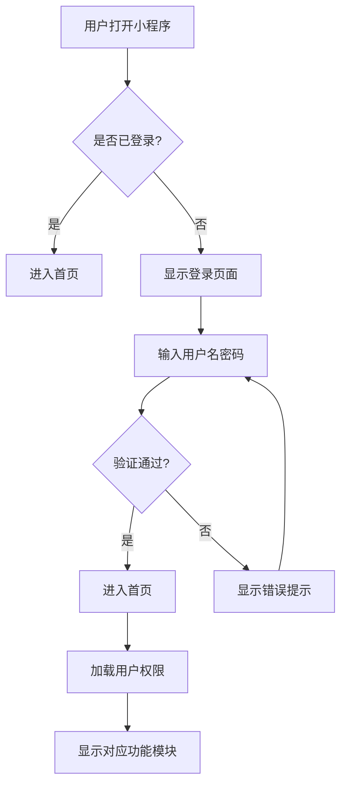
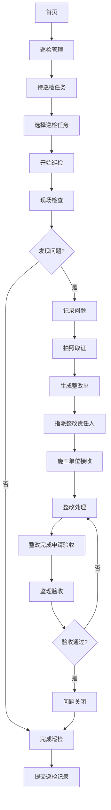
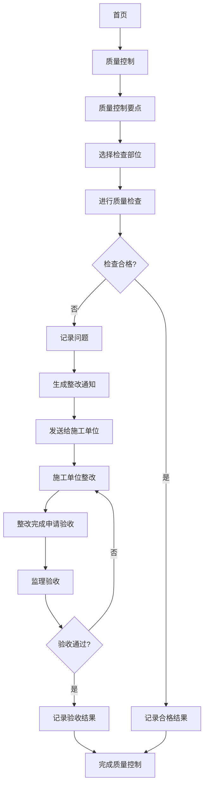
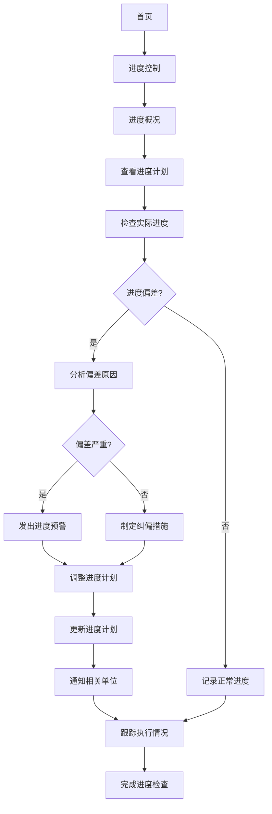
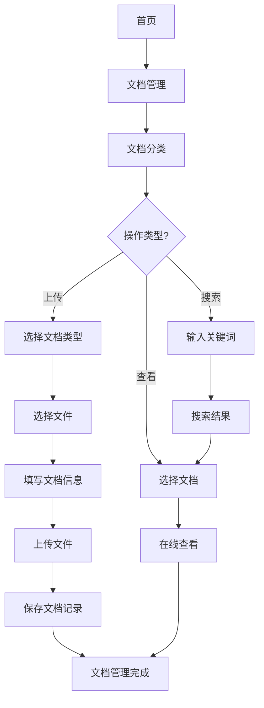
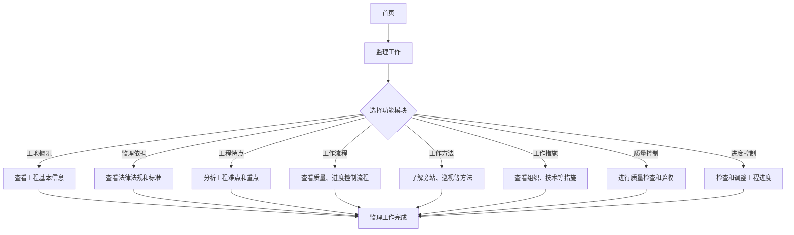
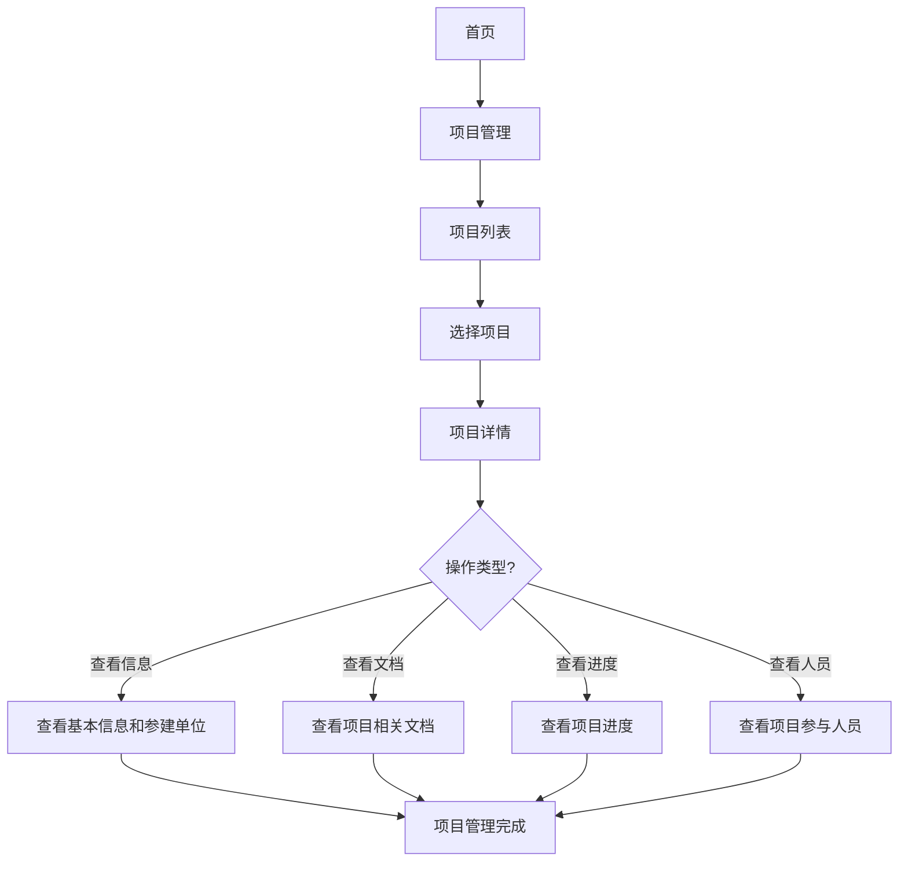
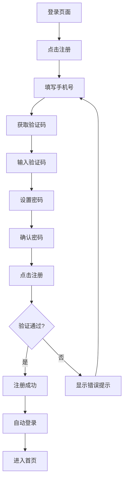
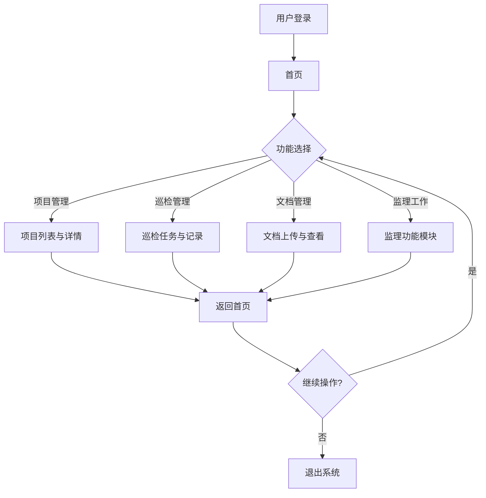
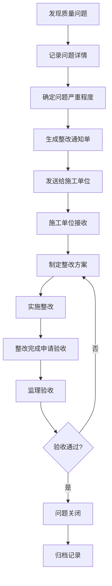

# 电力新能源工程监理管理系统
## 程序流程图

**文档版本**：V1.0
**编写日期**：2026-03-02
**编写单位**：技术支持部

---

## 1. 系统登录流程

## 2. 巡检管理流程

## 3. 质量控制流程

## 4. 进度控制流程

## 5. 文档管理流程

## 6. 监理工作流程

## 7. 项目管理流程

## 8. 注册流程

## 9. 系统整体流程

## 10. 质量问题处理流程

---

## 流程说明

### 1. 系统登录流程
- 用户打开小程序后，系统检查是否已登录
- 未登录用户需输入用户名密码进行验证
- 验证通过后加载用户权限并显示对应功能模块

### 2. 巡检管理流程
- 从首页进入巡检管理模块
- 选择待巡检任务并开始巡检
- 现场检查，记录发现的问题并拍照取证
- 生成整改单并指派责任人
- 施工单位接收后进行整改
- 整改完成后申请验收，监理验收通过后问题关闭

### 3. 质量控制流程
- 从首页进入质量控制模块
- 选择检查部位进行质量检查
- 检查不合格时记录问题并生成整改通知
- 施工单位整改后申请验收
- 监理验收通过后完成质量控制

### 4. 进度控制流程
- 从首页进入进度控制模块
- 检查实际进度与计划进度的偏差
- 分析偏差原因并制定纠偏措施
- 严重偏差时发出进度预警
- 调整进度计划并通知相关单位
- 跟踪执行情况

### 5. 文档管理流程
- 从首页进入文档管理模块
- 选择文档分类进行操作
- 支持文档上传、查看和搜索
- 上传文档时填写文档信息并保存

### 6. 监理工作流程
- 从首页进入监理工作模块
- 选择具体的功能子模块
- 查看工地概况、监理依据、工程特点等信息
- 了解监理工作流程、方法和措施
- 进行质量控制和进度控制

### 7. 项目管理流程
- 从首页进入项目管理模块
- 查看项目列表并选择具体项目
- 查看项目基本信息、参建单位、文档、进度和人员

### 8. 注册流程
- 从登录页面进入注册页面
- 填写手机号并获取验证码
- 输入验证码和设置密码
- 验证通过后注册成功并自动登录

### 9. 系统整体流程
- 用户登录后进入首页
- 选择不同的功能模块进行操作
- 操作完成后返回首页
- 可选择继续操作或退出系统

### 10. 质量问题处理流程
- 发现质量问题后记录详情并确定严重程度
- 生成整改通知单并发送给施工单位
- 施工单位制定方案并实施整改
- 整改完成后申请验收，监理验收通过后问题关闭并归档

---

## 流程优化建议

1. **流程自动化**：对于常规巡检任务，可以设置自动提醒和计划安排

2. **数据集成**：与其他系统（如ERP、BIM）集成，实现数据共享

3. **移动端优化**：针对移动设备的特性，优化操作流程，减少输入步骤

4. **智能预警**：基于历史数据，实现质量和进度的智能预警

5. **权限精细化**：根据不同角色和职责，设置更精细的权限控制

6. **数据分析**：增加数据分析功能，为决策提供支持

7. **离线操作**：支持离线操作，网络恢复后自动同步数据

8. **多端同步**：支持PC端和移动端数据同步，满足不同场景的使用需求

---

## 技术实现要点

1. **前端**：基于微信小程序开发，使用WXML、WXSS、JavaScript

2. **后端**：使用云函数或服务器端API，处理业务逻辑和数据存储

3. **数据库**：使用云数据库或关系型数据库，存储结构化数据

4. **存储**：使用对象存储服务，存储图片、文档等非结构化数据

5. **安全**：实现身份认证、数据加密、权限控制等安全措施

6. **性能**：优化前端加载速度，后端响应时间，确保系统流畅运行

7. **可扩展性**：采用模块化设计，便于后续功能扩展和维护

---

**文档审批**

| 审批人 | 职务 | 审批日期 | 审批意见 |
|--------|------|----------|----------|
| [姓名] | 项目经理 | YYYY-MM-DD | |
| [姓名] | 技术总监 | YYYY-MM-DD | |
| [姓名] | 客户代表 | YYYY-MM-DD | |
